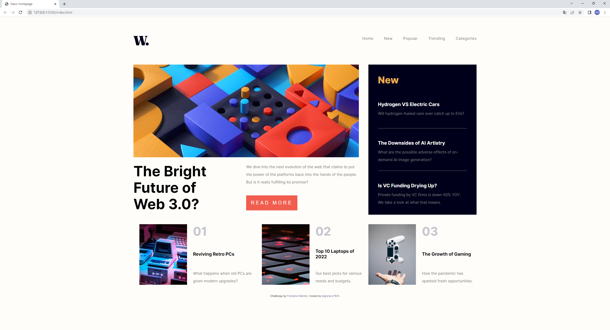

# Frontend Mentor - News homepage solution

HTML과 CSS를 사용하여 처음으로 만든 웹페이지다. 문제는 해당 사이트에서 참고하여 가지고 왔다. 조금 더 내가 개발을 더 할 줄 알게 되면 다른 웹사이트를 클론 코딩 할 수 있게 되었으면 좋겠다. (https://www.frontendmentor.io/challenges/news-homepage-H6SWTa1MFl).

## Table of contents

- [개요]
  - [스크린 샷](#screenshot)
- [개발 과정](#my-process)
  - [사용한 기술](#built-with)
  - [배운 것](#what-i-learned)
  - [어려웠던 것](#difficulties)
- [개발자](#author)

### Screenshot
<데스크 탑>

<모바일>


## My process

### Built With
- Semantic HTML5 markup
- CSS custom properties
- CSS FlexBox, Grid
- Responsive Web

### What I learned
1.
```
.main{
    height: 630px;
    overflow: hidden;
}

```
```
.main_sidebar{
    float: right;
    background-color: hsl(240, 100%, 5%);
    padding: 40px;
    width: 374px;
    height: 100%;
    margin-left: 40px;
    overflow: hidden;
}

```
한 div가 float되어 있고, 다른 div는 float되어 있지 않는 상태에서, div가 서로의 컨테이너의 width에 꽉 차게 만들고 싶다면 float되지 않은 다른 div에 overflow: hidden을 걸어주어야 한다.

2. 또한 반응형 웹에선 기존 스타일에 대한 초기화가 필요하다. 이걸 놓치면 레이아웃이 꼬이는 문제가 생기므로 잘 확인해 주어야 한다.

### Difficulties

1. 밑의 사진과 기사가 있는 파트만 flexbox를 사용하고 기타 레이아웃을 잡는데는 float를 사용하였는데, float를 사용하다보니 반응형 웹을 만드는데 어려움이 있었다.

2. float를 사용했더라도 기존에 배웠던대로 layout만을 담당하는 클래스와 component의 내용을 담당하는 클래스를
나누어 마크업 작업을 했으면 반응형 작업하기에도 더 유리
했겠다라는 생각을 했다. -> 추후 grid와 flex를 메인으로, float는 레이아웃이 아닌 오직 콘텐츠 배치용으로만 작업하였음.

3. 아직 반응형 웹에 익숙하지 않다. 그 외에도 Viewport width나 grid등 새로운 기능에 익숙해질 필요가 있겠다. 

## Author

- Website - [legionary7931](https://github.com/legionary7931/HTML_CSS_Project1_News_Main_Homepage)


